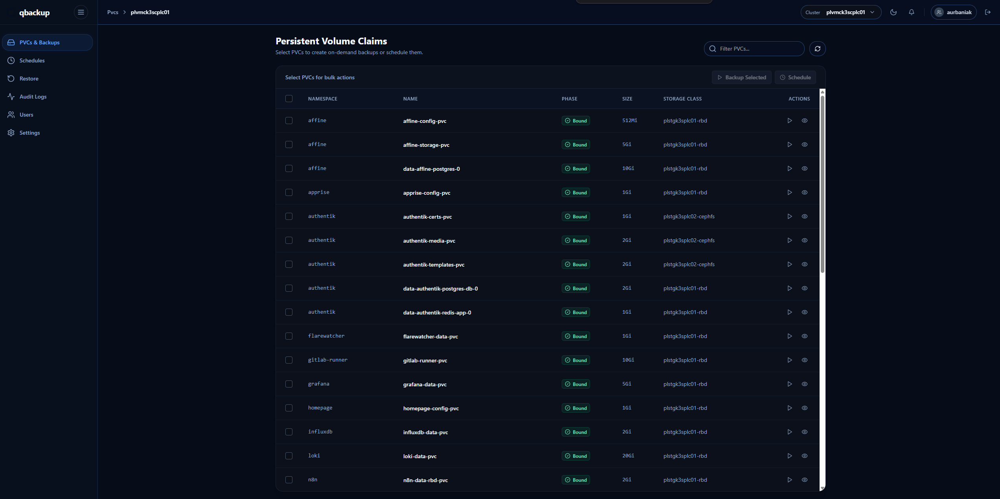
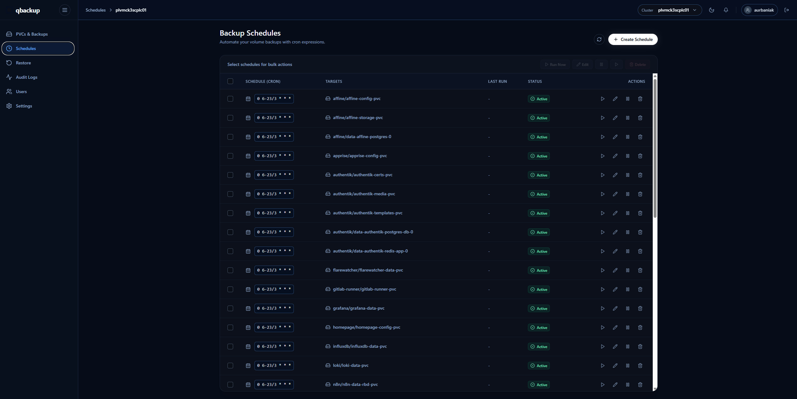

# qbackup

> [!WARNING]
> qbackup is **vibecoded** software. It controls Kubernetes backup and restore workflows, so review the code, test it on non-critical data, keep independent backups, and **use it at your own risk**.

<p align="center">
  
  
  
  
  
  
</p>

<p align="center">
  <strong>A self-hosted web UI for K3s and Kubernetes PVC backups.</strong>
</p>

<p align="center">
  Discover persistent volume claims, run on-demand backups, schedule recurring jobs, restore archives, and audit activity from one clean dashboard.
</p>

<p align="center">
  
</p>

<p align="center">
  
</p>

---

## What It Does

qbackup is a browser-based operations app for Kubernetes PVC backup and restore workflows. The server talks to Kubernetes through `kubectl`, creates helper Pods for backup and restore work, manages schedule CronJobs, stores local auth/config data, and streams job logs back to the UI.

It is built for homelab and self-hosted Kubernetes operators who want PVC backup workflows without living entirely in a terminal.

## Highlights

| Area | What qbackup gives you |
| --- | --- |
| **PVC discovery** | List persistent volume claims across namespaces with size, phase, storage class, and actions. |
| **On-demand backups** | Start single or bulk PVC backups from the dashboard. |
| **Schedules** | Create, edit, suspend, resume, manually run, and delete Kubernetes CronJob-based backup schedules. |
| **Restore** | Browse archive catalogs and launch restore jobs through helper Pods. |
| **Live logs** | Stream backup and restore job output into the web UI. |
| **Multi-cluster config** | Store cluster settings and switch active cluster context from the app. |
| **Users and roles** | Bootstrap the first admin, manage users, and assign role-based permissions. |
| **Audit trail** | Track auth, user, settings, schedule, backup, and restore actions. |
| **Self-hosting** | Run locally, in Docker, or inside Kubernetes with included manifests. |

## App Sections

- **PVCs & Backups** - discover PVCs, inspect details, and start backup jobs.
- **Schedules** - manage recurring backup schedules powered by Kubernetes CronJobs.
- **Restore** - browse backup archives and start restore workflows.
- **Audit Logs** - review application activity and job history.
- **Users** - manage local users and roles.
- **Settings** - configure Kubernetes context, cluster name, NFS target, backup root, helper image, retention, and defaults.

## Quick Start

Requirements:

- Node.js 20+
- npm
- `kubectl` configured for the target cluster

Run:

```bash
npm install
npm run dev
```

Open the app:

```text
http://localhost:5173
```

The API server listens on:

```text
http://localhost:8787
```

On Windows, local development works as long as `kubectl` is available to the server process. Host Bash is not required for backup or restore operations.

## Docker

Build and run:

```bash
docker build -t qbackup:latest .
docker run --rm -p 8787:8787 \
  -v qbackup-data:/data \
  -v ${PWD}/kubeconfig:/data/.kube/config:ro \
  qbackup:latest
```

Or use Compose:

```bash
docker compose up --build
```

Put your kubeconfig at `./kubeconfig`, or edit `docker-compose.yml` to mount the right file.

## Kubernetes

Build and push an image, then update `deploy/kubernetes/deployment.yaml`:

```yaml
image: your-registry/qbackup:tag
```

Apply the manifests:

```bash
kubectl apply -k deploy/kubernetes
```

The Kubernetes manifests create:

- `qbackup` namespace
- Service account and cluster-wide RBAC
- `qbackup-data` PVC for auth and config data
- Deployment and service

In Kubernetes, qbackup uses the in-cluster service account through `kubectl`. No kubeconfig mount is needed unless you want to point it at a different cluster.

## Authentication

The first visit opens a bootstrap screen where you create the initial admin account.

Auth data is stored locally at:

```text
~/.local/share/qbackup/auth.json
```

In the container image, this maps to:

```text
/data/.local/share/qbackup/auth.json
```

Roles:

| Role | Access |
| --- | --- |
| **admin** | All permissions |
| **manager** | Backup, restore, schedules, settings |
| **operator** | Backup, restore, schedules |
| **auditor** | Dashboard and audit logs |
| **viewer** | Read-only dashboard access |

## Configuration

Settings are stored locally at:

```text
~/.config/qbackup/config.env
```

In the container image, this maps to:

```text
/data/.config/qbackup/config.env
```

At startup, qbackup also loads `./.env` or the file pointed to by `QBACKUP_ENV_FILE`. Those values seed first-run defaults.

Important security-related environment variables:

```bash
QBACKUP_SECURE_COOKIES=true
QBACKUP_COOKIE_SAMESITE=strict
QBACKUP_TRUST_PROXY=true
QBACKUP_BOOTSTRAP_CLUSTER=false
```

## Production Notes

- Put qbackup behind HTTPS and set `QBACKUP_SECURE_COOKIES=true`.
- Keep `QBACKUP_TRUST_PROXY=true` when TLS terminates at an ingress or reverse proxy.
- Mount `/data` on persistent storage so auth, audit, and cluster config survive restarts.
- Review `deploy/kubernetes/rbac.yaml` before applying it. It intentionally grants cluster-wide access to PVCs, helper Pods, CronJobs, Jobs, and workload scaling.
- Use the first-run UI bootstrap to create the initial admin.
- Prefer a private image registry and pin immutable image tags instead of relying on `latest`.
- Test backup and restore behavior on disposable workloads before trusting it with important data.

## Useful Commands

```bash
npm run dev       # Start client and server in development
npm run client    # Start the Vite dev server
npm run server    # Start the Express API server
npm run build     # Build the frontend
npm run start     # Start the production API/static server
npm run preview   # Preview the built frontend
```

## Release Workflow

The GitHub Actions workflow publishes Docker images on pushes to `main`.

It calculates the next patch version tag, creates a Git tag, and pushes:

```text
aleksanderurbaniak/qbackup:latest
aleksanderurbaniak/qbackup:vMAJOR.MINOR.PATCH
```
